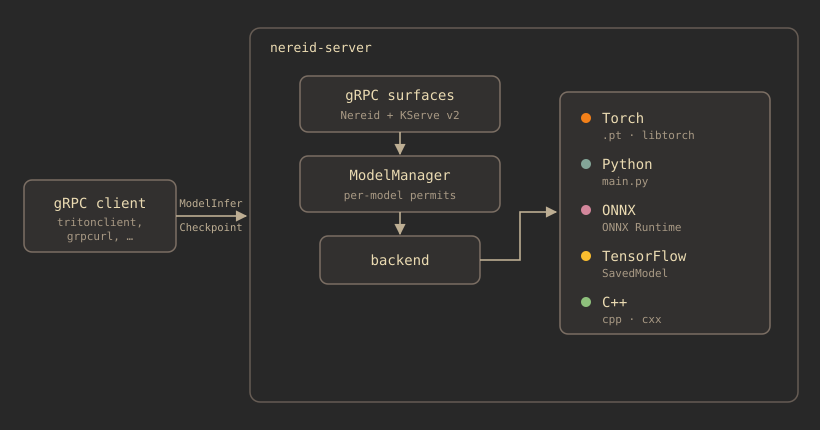

# nereid-server

A nifty little Rust inference server. nereid reads a config file, loads the models you list in it,
and serves them over gRPC — both its own native `Nereid` service and the standard KServe v2 gRPC
surface on the same address, so any KServe v2 client (a stock `tritonclient` included) can drive it
without changing a line of client code.

How a model actually runs is the job of a **backend**. Backends are self-contained and
self-registering, so the server core has no idea which ones exist, and you compile in only the
ones you want.

## At a glance

<figure markdown="span">
  { width="820" style="max-width:100%;height:auto" loading="lazy" }
</figure>

## What to read next

- **[Architecture](architecture.md)** — the two gRPC surfaces, the `ModelManager`, how requests are
  bounded, and how one gets to a backend.
- **[Backends](backends.md)** — the backends that ship today, how the server finds them, and how you
  add one of your own.
- **[Model contract](model-contract.md)** — what goes in a model folder, what
  `model_inference.textproto` says, the batching rules, and the subprocess tensor contract.
- **[KServe v2 compatibility](triton.md)** — how nereid speaks KServe v2 on the wire, which RPCs
  are implemented, and how to check that for yourself.
- **[Prometheus metrics](metrics.md)** — Triton's inference request metrics, served on `/metrics`,
  and what each one measures in nereid.
- **[Building & running](building.md)** — `build.sh`, the libtorch dependency, linking modes, HPC
  builds, and choosing your backends.

## Core ideas

- **Config-driven.** `nereid.yaml` lists the models to expose, each model's device, and how many
  requests it will hold at once. If a model isn't in the config, it isn't served.
- **Folder-per-model.** Every model is a directory under `server.ml_backends_path`, and the server
  works out its backend from what's in the folder (or from an explicit `backend:` in the config).
- **Speaks the KServe v2 standard.** The `inference.GRPCInferenceService` surface is vendored from
  the KServe v2 spec, so what goes over the wire is byte-compatible with any client of it. See
  [KServe v2 compatibility](triton.md).
- **Observable like Triton.** The inference request metrics — `nv_inference_*` counts, latencies,
  and the pending gauge — are served for Prometheus under Triton's names, so existing dashboards
  and alerts carry over, and the KServe v2 `/v2/health/*` endpoints answer Kubernetes probes.
  See [Metrics](metrics.md).
- **Backends are discovered, not listed.** Each one lives in its own folder and registers itself at
  link time, so nothing in the core enumerates them, and adding a backend doesn't mean editing the
  core. An ONNX-only build links no libtorch at all.
